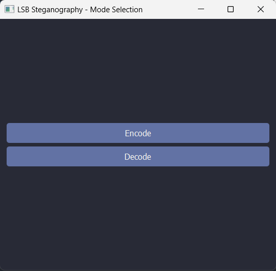
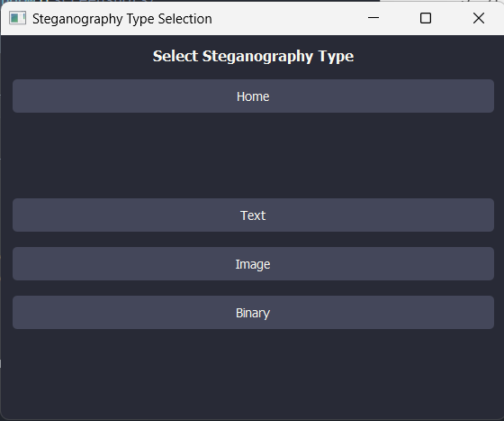
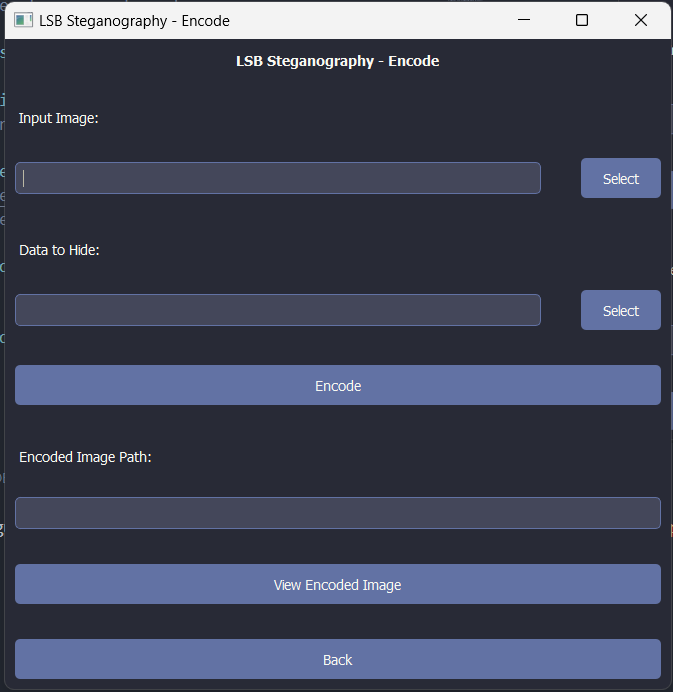
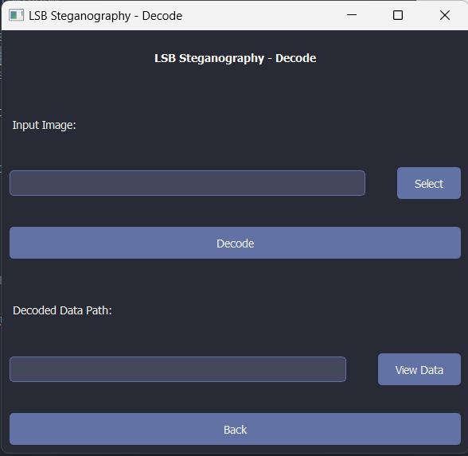

# pygui-steganography

pygui-steganography is a Python-based GUI application that allows users to perform steganography, which is the practice of concealing data within other data. This application is built on top of the [LSB-Steganography](https://github.com/RobinDavid/LSB-Steganography) project and provides a user-friendly interface for encoding and decoding data using the Least Significant Bit (LSB) technique.

## Features

- Encode and decode text, images, and binary data within images
- Intuitive graphical user interface using PyQt5
- Support for various image formats (PNG, BMP)
- Customizable steganography options

## Screenshots

<p align="center">
  
  <br>
  <em>Mode Selection Window</em>
</p>

<p align="center">
  
  <br>
  <em>Steg Type Selection Window</em>
</p>

<p align="center">
  
  <br>
  <em>Encode Window</em>
</p>

<p align="center">
  
  <br>
  <em>Decode Window</em>
</p>

## Installation

Clone the repository:
```bash
git clone https://github.com/prakash-aryan/pygui-steganography.git
```

Install dependencies:
```bash
pip install -r requirements.txt
```

## Usage

Launch:
```bash
python main.py
```

1. Select Mode: Choose "Encode" or "Decode."
2. Choose Steganography Type: Select "Text", "Image", or "Binary."
3. Encoding:
   - Choose the carrier image.
   - Select the data to hide (text, image, or binary file).
   - Click "Encode" to embed your data.
   - The encoded image will be saved, and you'll see its path.
4. Decoding:
   - Choose the image containing hidden data.
   - Click "Decode" to reveal the message.
   - The extracted data will be saved, and you'll see its path.

## Changes and Additions

The following changes and additions have been made to the original LSB-Steganography project:

- Implemented a graphical user interface using PyQt5.
- Added support for encoding and decoding text, images, and binary data.
- Improved error handling and user feedback through dialog boxes.
- Organized the codebase into separate modules for better maintainability.
- Introduced a styles module for consistent styling of UI elements.
- Created utility functions for displaying error and success messages.


## License

This project is licensed under the [MIT License](LICENSE).

## Acknowledgments

- Original LSB-Steganography project: [RobinDavid/LSB-Steganography](https://github.com/RobinDavid/LSB-Steganography)
- PyQt5 documentation: [PyQt5 Reference Guide](https://doc.qt.io/qtforpython/)